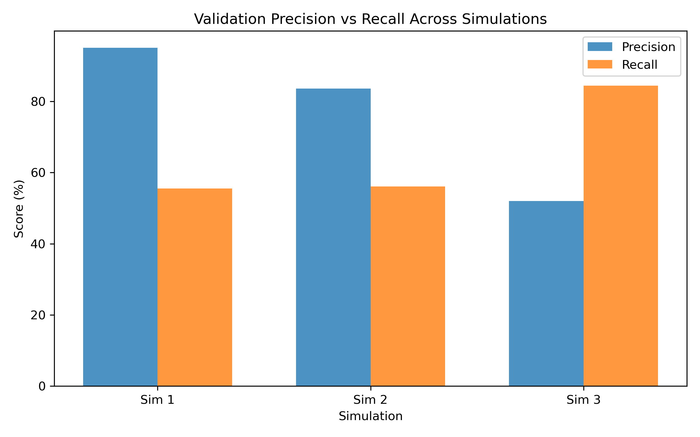

# 🕵️‍♀️ JobScout AI

JobScout AI is a neural network-based binary classification project built to detect fraudulent job postings. Using natural language processing (NLP) and TensorFlow, it analyzes job descriptions and titles to predict the likelihood of fraud, aiming to support job seekers by filtering out deceptive listings.

---
## 🌐 Live Demo on Hugging Face

Want to test JobScout AI instantly? Try it now on [Hugging Face Spaces](https://huggingface.co/spaces/gwen-s/jobscout-ai)!

[](https://huggingface.co/spaces/gwen-s/jobscout-ai)

**Usage:**

1. Paste a full job posting (title + description) into the textbox.
2. Receive a real-time fraud risk assessment.
3. All submissions are logged internally for future model improvements.

⚠️ *This version uses only the job text and flags jobs with a fraud probability ≥ 83%.*

---


## 📦 Project Structure

```
JobScout-AI/
├── .gitignore                    # Ignored files for version control
├── EDA.ipynb                     # Exploratory Data Analysis notebook
├── gradio_app.py                # Main Gradio app entry point
├── LICENSE                      # Project license
├── README.md                    # Project overview and usage
├── requirements.txt             # Core project dependencies
├── data/                        # Processed and raw datasets - files excluded from github due to size
├── images/                      # Visualizations and plots
   ├── confusion_matrix.png
   ├── precision_recall_comparison.png
   ├── precision_recall_curve.png
   ├── threshold_optimization.png

├── logs/                        # Evaluation logs and final reports
    ├── classification_report.txt
    ├──  eval_summary.md
    ├──  jobscout_logs_final.csv
├── models/                      # Model + vectorizer artifacts
   ├── archived/                # Archived models
   ├──  jobscout_model_v1.keras
   ├──jobscout_pipeline_v1.keras
├── notebook/                    # Metric visualizations (Jupyter)
   ├──precision_recall_graph.ipynb
├── real_world_examples/         # Real job ads for evaluation
├── scripts/                     # Training and evaluation scripts
   ├── analyze_threshold.py
   ├── classification_report.py
   ├── generate_eval_results.py
   ├── merge_training_data.py
   ├── split_train_validation.py
   ├── train_data_.py

```

---

## 🔍 Features

* 🤖 **Binary Fraud Classifier** — Real vs Fake job posting prediction
* 🧠 **LSTM Neural Network** — Advanced architecture for text classification
* ⚖️ **Class Weighting** — Addressing dataset imbalance
* 📊 **Validation Metrics Tracking** — Accuracy, Precision, Recall, Loss
* 📈 **Visualizations** — Metrics comparison across 3 model versions

---

## 🧪 Model Testing Summary

| Simulation | Architecture        | Precision (%) | Recall (%) | Val Accuracy (%) | Val Loss |
| ---------- | ------------------- | ------------- | ---------- | ---------------- | -------- |
| Sim 1      | Dense (16x2)        | 95.05         | 55.49      | 97.71            | 0.0846   |
| Sim 2      | Embedding + Dropout | 83.62         | 56.07      | 97.34            | 0.0889   |
| Sim 3      | LSTM + Dropout      | 51.96         | 84.39      | 95.47            | 0.1464   |

🔗 [View full training logs](logs/training_log.md)

---

## 🧰 Tools & Technologies

* Python, Pandas, NumPy
* TensorFlow, Keras
* Scikit-learn
* JupyterLab (for EDA and prototyping)
* Matplotlib (visualizations)

---

## 📊 Visual Summary



---

## 📁 Data Source

Dataset: `fake_job_postings.csv` from Kaggle [fake-job-posting-prediction](https://www.kaggle.com/datasets/shivamb/real-or-fake-fake-jobposting-prediction)

---

## ▶️ How to Run

1. Clone the repository
2. Install dependencies:

   ```bash
   pip install -r requirements.txt
   ```
3. Launch the Gradio app locally:

   ```bash
   python gradio_app.py
   ```

---

## 🚀 Future Enhancements

* Add GloVe or FastText embeddings
* Build web form for testing job posts
* ROC & PR-AUC visual dashboards

---

## 🧠 Author

Gwen Seymour — [LinkedIn](https://www.linkedin.com/in/gwen-seymour) | [GitHub](https://github.com/Gwen1987)

> JobScout AI was built to sharpen TensorFlow skills and explore real-world NLP challenges that affect job seekers worldwide.
